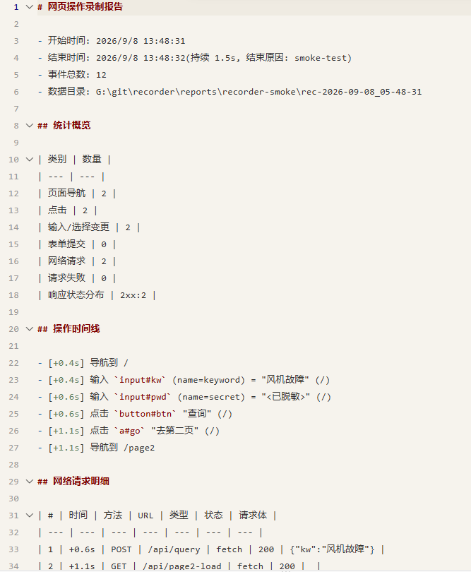
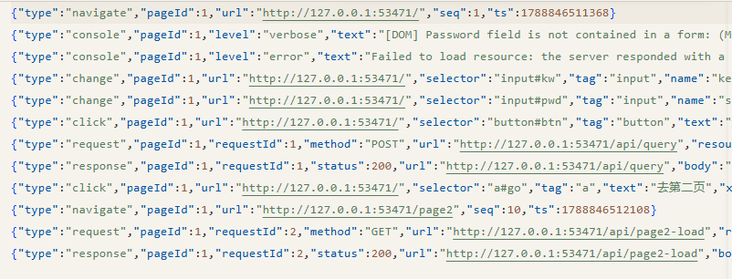

# dsh-web-recorder

**语言：简体中文 · [English](README_EN.md)**

网页操作录制器插件：面向「用户手动操作浏览器，插件在后台录制」的场景。启动一个有头浏览器窗口（默认本机 Edge），用户在窗口里正常点网页，插件在后台记录每次点击 / 输入 / 表单提交和每个网络请求 / 响应 / 失败，停止后生成 Markdown 摘要报告。

## 设计初衷

要让 agent 直接通过接口对接某个业务平台（例如 EIP 类系统），前提是先搞清楚三件事：平台暴露了哪些接口、每个业务步骤对应调用哪个、参数和响应是什么格式。传统做法是查接口文档或逆向前端代码，但文档往往缺失或过时，而且就算有了接口清单，也很难把「用户在页面上的业务操作」和「背后触发的接口调用」一一对上。

本插件换一种思路：**不逆向，只留操作依据**。开发者先让记录仪就位（`recorder_start`），再让目标业务流程在一个受监控的有头浏览器窗口里完整跑一遍即可——操作可以由真人手动完成，也可以交给 playwright MCP / browser-use 等浏览器自动化工具按步骤驱动——之后不需要再翻文档，因为这次操作留下的原始数据已经回答了上面三个问题：

- **UI 事件线**：每一步点击 / 输入 / 表单提交发生在何时、落在哪个元素、填了什么值；
- **网络事件线**：每一步操作触发了哪些 `xhr`/`fetch` 请求——method、URL、请求头、请求体、响应体、失败原因。

两类事件按时间交错实时写入 `events.jsonl`，两条线天然对齐：任何一个业务步骤，都能在原始数据里找到「它调了哪个接口、参数怎么填、返回了什么」。停止后生成的 `report.md` 再把这套操作时间线与请求明细整理成便于阅读的摘要。

得到这些原始依据后，交给大模型做分析：归纳出完整的「业务流程 × 接口调用序列 × 数据契约」，再沉淀为 skill——把流程拆成步骤，注明每步该调哪个接口、请求 / 响应长什么样、出错怎么办——让 agent 之后照着 skill 直接走接口完成任务，整个过程不再依赖人工演示。

一句话概括：**页面操作一遍 = 留下可分析的操作依据 = 大模型据此制作接口级 skill 的原料**。录制本身只是采集，分析和沉淀交给模型完成。

## 效果预览

下面是一次真实录制的产物截图（`tests/smoke.mjs` 冒烟测试在一个本地页面执行「输入关键词 → 查询 → 去第二页」的完整流程）。

**① `report.md` 摘要**——统计概览 + 操作时间线 + 网络请求明细，把「业务步骤」和「接口调用」整理在同一张表里：



**② `events.jsonl` 原始事件流**——每一行一个事件（导航 / 点击 / 输入 / 请求 / 响应…），按发生时间交错实时落盘，是分析时最完整的操作依据：



两张图对照着看：一次「输入关键词并查询」的操作，在 `events.jsonl` 里留下了对应的 `POST /api/query` 请求与 `200` 响应事件，在 `report.md` 里则汇总成一行请求明细——这正是设计初衷里「页面操作一遍，留下可分析的操作依据」的直观体现。

## 注册的工具

| 工具                   | 说明                                                                    |
| ---------------------- | ----------------------------------------------------------------------- |
| `recorder_start(url?)` | 开始录制：启动有头浏览器并可导航到起始 URL；事件实时落盘 `events.jsonl` |
| `recorder_stop()`      | 停止录制：生成 `report.md` 摘要报告并关闭浏览器；幂等                   |
| `recorder_status()`    | 查询状态：是否在录制、事件分类计数、产物目录、上一次收尾结果            |

用户直接关掉浏览器窗口会自动收尾（`reason: browser-closed`），已录数据不丢。

## 使用方法:如何命中本插件

### 什么时候会命中（触发场景）

插件的 3 个工具会随插件启用出现在 DSH 会话的工具列表里，「命中」发生在模型做工具选择时——依据是工具名与描述。当用户任务属于「查清某个网页业务流程背后调用了哪些接口、参数/响应长什么样，并据此生成接口级流程说明或 skill」时，模型应主动调用 `recorder_*`。典型任务表述：

- "帮我把在 XX 平台上『xxx』流程背后调用的接口和调用顺序理清楚，做成 skill，让我以后直接用接口完成"
- "XX 页面点『查询』时发的请求是什么？参数怎么传？"
- "我在页面上操作一遍，你录下来，然后分析生成接口对接说明"

如果只是回答不涉及真实页面操作的问题（例如直接查文档就能答），模型通常不会命中本插件。

### 工具如何可用（加载）

本仓库即 DSH 插件：入口 `lib/index.js`（源码 `src/index.ts`），经 `package.json` 的 `dsh.bundle.patch` 指向仓库根 `cordis.patch.yml` 并入宿主 profile（其中 `id`/`name` 均为 `dsh-web-recorder`）；`@deepseek-ai/*` 由宿主按 `peerDependencies` 提供。插件启用后工具即进入模型工具列表，无需额外声明即可被选择。

### 职责划分：本插件只「记录」，「打开页面 / 操作」交给驱动方

本插件**不直接操作页面**——工具只有 `recorder_start / recorder_stop / recorder_status`，职责是「旁观并记录」：它启动一个受监控的有头浏览器窗口，把窗口里发生的每一步 UI 操作与每个网络请求原样落盘。真正「打开 XXXX 页面并按步骤操作」的是**浏览器驱动方**，可以是：

1. **真人**：在插件弹出的窗口里手动点击 / 输入 / 跳转；
2. **playwright MCP**：模型通过它打开页面、点击、填表，把目标流程一步步执行出来；
3. **其他 browser-use 类工具**：同样作为"手"来驱动浏览器执行流程。

模型（agent）在会话里做编排：先让记录仪就位，再指挥驱动方执行流程，最后收尾并读取产物分析。

### 配合 playwright MCP / browser-use 的推荐流程（打开 X 页面 → 录制步骤）

1. **记录仪就位**：`recorder_start("http://目标页面")`——弹出受监控浏览器并打开起始页，从此刻起窗口内一切操作与网络请求都开始实时落盘 `events.jsonl`
2. **驱动方执行流程**：让 playwright MCP / browser-use（或真人）**在同一个受监控窗口里**逐步完成目标流程——打开各页面、填写表单、点击提交、翻页……每步操作的 UI 事件和它触发的接口调用都会被同时录下
3. **（可选）查进度**：`recorder_status()`——查看是否在录制、事件分类计数、产物目录
4. **收尾**：`recorder_stop()`——生成 `report.md` 摘要报告并关闭浏览器（用户直接关窗口也会自动收尾）
5. **分析沉淀**：模型读取 `report.md` + `events.jsonl`，归纳「流程步骤 × 接口调用 × 请求/响应契约」，进一步沉淀为 skill 或接口对接文档

### 协同前提（重要）

- 录制范围是**插件自己启动的那个浏览器窗口**（含其新标签页与 iframe）；驱动方（真人或自动化工具）的操作必须发生在**这个窗口里**才会被录到。
- 当前实现的窗口由插件自启、面向人工直接操作；若要由 playwright MCP / browser-use 等自动化工具驱动**同一个**窗口，需要驱动工具能附着到该浏览器实例（共享实例 / CDP 连接）——此能力尚未内置，见下方「已知限制」。

### 前置条件与注意

- 本机需装有浏览器：默认用 Edge（`channel: msedge`），可配 `chrome` 或 `executablePath`；插件不下载浏览器
- 至少要有一种浏览器驱动方在场：真人演示，或 playwright MCP / browser-use 等自动化工具
- 有头窗口在录制期间可见，属预期，结束即关闭
- `events.jsonl` 含请求头/请求体/响应体等完整数据，按敏感数据处理，勿外发

## 录制内容

- **UI 事件**：点击（选择器 + 元素文本 + 坐标）、输入/选择变更（name + 值，密码框只记录动作不落值）、表单提交、页面导航。通过 `context.exposeBinding` + `addInitScript` 捕获阶段监听实现，覆盖新标签页与 iframe。
- **网络事件**：默认只录 `xhr`/`fetch` 接口调用（`requestResourceTypes` 可调）——每个请求的 method/URL/resourceType/请求头/请求体，响应的状态码与响应体（截断），失败请求的错误原因。可选记录 console 消息。
- **产物**：每次录制在 `<outputDir>/rec-<时间戳>/` 下生成 `events.jsonl`（完整数据，逐行实时写入）和 `report.md`（操作时间线 + 请求明细表 + 失败请求摘要）。

## Config 字段

| 字段                    | 默认值                                                          | 说明                                                                                                                     |
| ----------------------- | --------------------------------------------------------------- | ------------------------------------------------------------------------------------------------------------------------ |
| `channel`               | `msedge`                                                        | playwright-core 浏览器渠道（`msedge`/`chrome`），使用本机已装浏览器，不下载 Chromium                                     |
| `executablePath`        | `''`                                                            | 自定义浏览器可执行文件路径，非空时覆盖 `channel`                                                                         |
| `outputDir`             | `''`                                                            | 产物输出根目录；空则默认当前工作目录（用户正在操作的文件夹，harness 会话 cwd）下 `reports/recorder` |
| `captureResponseBodies` | `true`                                                          | 是否抓取 xhr/fetch 响应体                                                                                                |
| `maxBodyBytes`          | `16384`                                                         | 单个请求体/响应体最大记录字节数，超出截断                                                                                |
| `recordConsole`         | `false`                                                         | 是否记录 console 消息                                                                                                    |
| `requestResourceTypes`  | `xhr,fetch`                                                     | 逗号分隔的 resourceType 白名单，只有命中的请求才录制（响应/失败事件随请求一并过滤）；默认只录接口调用，静态资源/文档不录 |
| `redactHeaders`         | `cookie,authorization,proxy-authorization,x-api-key,set-cookie` | 逗号分隔的脱敏请求头名（大小写不敏感），命中头值记为 `<redacted>`                                                        |

## 构建与验证

```sh
pnpm install       # 安装依赖(devDependencies 与 peerDependencies 对齐)
pnpm typecheck     # tsc --noEmit
pnpm test          # vitest 单元测试(report 生成纯函数)
pnpm build         # tsdown 产物到 lib/(插件加载与 smoke 依赖产物)
pnpm smoke         # 真实 Edge 端到端冒烟(需本机已装浏览器, 产物在 reports/)
```

## 仓库收录清单(awesome-dsh-plugin)

本仓库已按 awesome-dsh-plugin/contributing 对齐:

- `package.json` 声明 `dsh.bundle.patch: ./cordis.patch.yml`(见仓库根 `cordis.patch.yml`, 其中 id 与插件内部注册名 `dsh-web-recorder` 一致)
- 官方 `@deepseek-ai/*` 包放在 `peerDependencies`: `dsh-tools` 的范围带显式预发布分支(harness 以 rc 版本发布, 无分支的宽范围会被 node-semver 静默排除), `cordis`/`schemastery` 同为 peer 由宿主提供
- 运行时默认产物输出到**当前工作目录（用户正在操作的文件夹）**下 `reports/recorder`，可用 `Config.outputDir` 显式指定
- 附带真实冒烟测试 `tests/smoke.mjs`, 非占位仓库

若提交 awesome-dsh-plugin 收录条目:

1. 在 GitHub 仓库 Settings → Topics 添加 `dsh-plugin`
2. 一句话描述与代码实际能力一致、不夸大(例如称"3 个工具"就必须真有 3 个)
3. 可选: 发布 npm(须保证 `repository` 指回本仓库, 并去掉 `private: true`); 可选在仓库根放 `screenshots.json`

## 已知限制

- 只录制插件自己启动的浏览器窗口（含其新标签页 / iframe），无法录制其他浏览器实例里的操作——包括 playwright MCP / browser-use 等自动化工具另起的实例。要让自动化工具的操作被录到，需让它们驱动与记录仪相同的浏览器实例（共享 / CDP 连接），此能力尚未内置（路线待办）。
- 请求头中的敏感头默认脱敏；请求体/响应体不做内容级脱敏（可能含 token 等业务数据），`events.jsonl` 应按敏感数据处理，不要外发。
- 跨域 iframe 的 UI 事件依赖 init script 注入，极少数强 CSP 页面可能注入失败（网络事件不受影响）。
- 点击接口请求后立即跳转页面时，浏览器会取消该响应体的抓取，此场景响应体可能缺失（事件仍在，只是无 body）。
